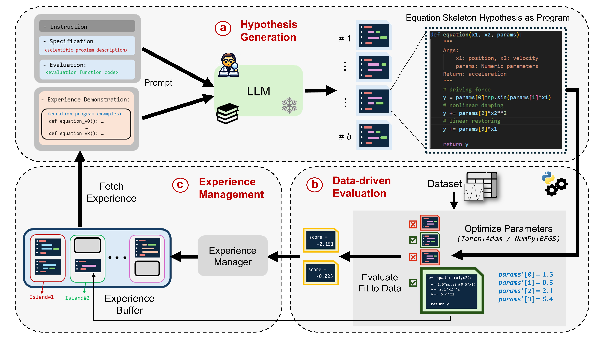

# `LLM-SR`: Scientific Equation Discovery and Symbolic Regression via Programming with LLMs

[](https://arxiv.org/abs/2404.18400)
[](./data/)


Official Implementation of paper [LLM-SR: Scientific Equation Discovery via Programming with Large Language Models](https://arxiv.org/abs/2404.18400) **(ICLR 2025 Oral)**.


## Updates
- Our recent more comprehensive benchmark [LLM-SRBench: A New Benchmark for Scientific Equation Discovery with Large Language Models](https://arxiv.org/abs/2504.10415) **(to appear at ICML 2025 as Oral)** is released following this work to effectively test LLM-based scientific equation discovery methods beyond memorization. Check out the benchmark data on [huggingface](https://huggingface.co/datasets/nnheui/llm-srbench) and evaluation codes [here](https://github.com/deep-symbolic-mathematics/llm-srbench).


## Overview
In this paper, we introduce **LLM-SR**, a novel approach for scientific equation discovery and symbolic regression that leverages strengths of Large Language Models (LLMs). LLM-SR combines **LLMs' scientific knowledge** and **code generation** capabilities with **evolutionary search** to discover accurate and interpretable equations from data. The method represents equations as program skeletons, allowing for flexible hypothesis generation guided by domain-specific priors. Experiments on custom benchmark problems across physics, biology, and materials science demonstrate LLM-SR's superior performance compared to state-of-the-art symbolic regression methods, particularly in out-of-domain generalization. The paper also highlights the limitations of common benchmarks and proposes new, challenging datasets for evaluating LLM-based equation discovery methods.




## Installation

To run the code, create a conda environment and install the dependencies provided in the `requirements.txt` or `environment.yml`:

```
conda create -n llmsr python=3.11.7
conda activate llmsr
pip install -r requirements.txt
```

or 

```
conda env create -f environment.yml
conda activate llmsr
```

Note: Requires Python ≥ 3.9


## Datasets
Benchmark datasets studied in this paper are provided in the [data/](./data) directory. For details on datasets and generation settings, please refer to [paper](https://arxiv.org/abs/2404.18400).


## Local Runs (Open-Source LLMs)

### Start the local LLM Server

First, start the local LLM engine from huggingface models by using the `bash run_server.sh` script or running the following command: 

```
cd llm_engine

python engine.py --model_path mistralai/Mixtral-8x7B-Instruct-v0.1 \
                    --gpu_ids [GPU_ID]  \
                    --port [PORT_ID] --quantization
```

* Set `gpu_ids` and `port` parameters based on your server availability

* Change `model_path` to use a different open-source model from Hugging Face

* `quantization` activates efficient inference of LLM with quantization on GPUs

* Control quantization level with `load_in_4bit` and `load_in_8bit` parameters in [engine.py](./llm_engine/engine.py)


### Run LLM-SR on Local Server
After activating the local LLM server, run the LLM-SR framework on your dataset with the `run_llmsr.sh` script or running the following command: 

```
python main.py --problem_name [PROBLEM_NAME] \
                   --spec_path [SPEC_PATH] \
                   --log_path [LOG_PATH]
```

* Update the `port` id in the url in [sampler.py](./llmsr/sampler.py) to match the LLM server port

* `problem_name` refers to the target problem and dataset in [data/](./data)

* `spec_path` refers to the initial prompt specification file path in [spec/](./specs) 

* Available problem names for datasets: `oscillator1`, `oscillator2`, `bactgrow`, `stressstrain`

For more example scripts, check `run_llmsr.sh`. 


## API Runs (Closed LLMs)
To run LLM-SR with the OpenAI GPT API, use the following command: 

```
export API_KEY=[YOUR_API_KEY_HERE]

python main.py --use_api True \
                   --api_model "gpt-3.5-turbo" \
                   --problem_name [PROBLEM_NAME] \
                   --spec_path [SPEC_PATH] \
                   --log_path [LOG_PATH]
```

* Replace `[YOUR_API_KEY_HERE]` with your actual OpenAI API key to set your API key as an environment variable. 

* `--use_api True`: Enables the use of the OpenAI API instead of local LLMs from Hugging Face

* `--api_model`: Specifies the GPT model to use (e.g., "gpt-3.5-turbo", "gpt-4o")

* `--problem_name`, `--spec_path`, `--log_path`: Set these as in the local runs section


## Runs with Torch Hypothesis Optimizer

Most specifications in [specs/](./specs) use equation program skeleton in `numpy` templates with `scipy BFGS` optimizer. LLM-SR can also leverage direct and differentiable optimizers for equation discovery. We provide specifications for the Oscillation 2 example using `torch` templates with `Adam` optimizer [here](./specs/specification_oscillator2_torch.txt).

Note: We observed slightly better performance from `numpy+BFGS` compared to `torch+Adam`, mainly due to better proficiency of current LLM backbones in numpy generation.


## Configuration 

The above commands use default pipeline parameters. To change parameters for experiments, refer to [config.py](./llmsr/config.py).


## Citation
Read our [paper](https://arxiv.org/abs/2404.18400) for more information about the setup (or contact us ☺️)). If you find our paper or the repo helpful, please cite us with
<pre>
@article{shojaee2024llm,
  title={Llm-sr: Scientific equation discovery via programming with large language models},
  author={Shojaee, Parshin and Meidani, Kazem and Gupta, Shashank and Farimani, Amir Barati and Reddy, Chandan K},
  journal={arXiv preprint arXiv:2404.18400},
  year={2024}
}
</pre>


## Star History

[](https://www.star-history.com/#deep-symbolic-mathematics/LLM-SR&Date)


## License 
This repository is licensed under MIT licence.

This work is built on top of other open source projects, including [FunSearch](https://github.com/google-deepmind/funsearch), [PySR](https://github.com/MilesCranmer/PySR), and [Neural Symbolic Regression that scales](https://github.com/SymposiumOrganization/NeuralSymbolicRegressionThatScales). We thank the original contributors of these works for open-sourcing their valuable source codes. 


## Contact Us
For any questions or issues, you are welcome to open an issue in this repo, or contact us at parshinshojaee@vt.edu, and mmeidani@andrew.cmu.edu .
